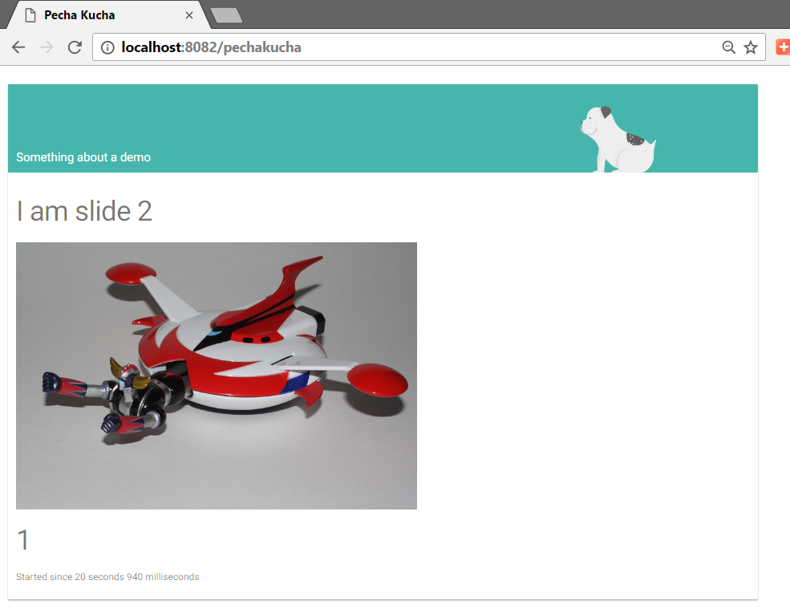

Pecha Kucha
===========



Put `PKSlides` under the image folder.
Edit the slides, add your own.
Images can go directly under images.
Same as CSS and Javascript.
These are served by the image as well.

Load the package:

```Smalltalk
Metacello new
    githubUser: 'Pharophile' 
    project: 'PechaKucha' 
    commitish: 'master' 
    path: 'src';
    baseline: 'PechaKucha';
    onWarningLog;
    load
```
The loading executes:

```Smalltalk
PKApplication declareApplicationAndStartServer.
```

This starts a server on port 8080.

Open the application on (http://localhost:8080/pechakucha).

This projet uses [MaterialDesignLite for Seaside](https://github.com/DuneSt/MaterialDesignLite)


